================================================================================
                    Introduction to ``xml2rfc`` Version 3
================================================================================
:Author: Henrik Levkowetz henrik@levkowetz.com
:Date: 20 Feb 2019

.. sectnum::

.. contents::

--------------------------------------------------------------------------------

Abstract
========

This document is intended to give an overview of the changes to ``xml2rfc``
resulting from the introduction of new renderers to support vocabulary version
3 of the RFC and Internet-Draft ``XML`` markup language.

Introduction
============

In 1999, Marshall Rose presented an ``XML`` markup language for RFCs and 
Internet-Drafts in `RFC 2629`_.  He also at the same time provided a tool
to convert the ``XML`` markup to the text format used for RFC and draft publication.

In December 2016, `RFC 7991`_ presented a revised and expanded markup vocabulary
based on the original `RFC 2629` vocabulary.  Given that the `RFC 2629` vocabulary
had received a number of extensions over the years, the de facto vocabulary
implemented by the ``xml2rfc`` tool in 2016 was called vocabulary '``v2``' for short,
and the vocabulary in `RFC 7991`_ was called '``v3``'.

Recent versions of ``xml2rfc``, starting with version 2.7.0, have gradually
introduced features to support the ``v3`` vocabulary.  This document aims at giving
an overview of how the new features have been assembled and made available
in ``xml2rfc``.

The ``v3`` ``XML`` Schema
=========================

The ``v3`` ``XML`` schema is a superset of the ``v2`` schema.  This means that
any ``v2`` input document is a valid document according to the ``v3`` schema.

The original v3 specification, `RFC 7991`_, did however specify a number of
elements as being deprecated, and `RFC 7998`_ went on to specify that the
``preptool``, which is run before any ``v3`` renderer, will limit elements
appearing in the new RFC publication format to not include any deprecated
elements.  

This means that while any ``v2`` document is valid input to the ``xml2rfc``
tool, any deprecated ``XML`` elements will be transformed to ``v3``-specific
constructs before being processed by the ``preptool`` and the ``v3`` renderers.
More about this under `Syntax Changes in v3 XML Sources`_ below.

This distinction should be clear when looking at the ``xml2rfc`` processing
flow.

When speaking about ``v3`` ``XML`` in this remainder of this document, what
is meant is ``XML`` that does not use any of the deprecated ``v2`` elements.

Processing Flow
===============

Conceptually, the following diagram shows the processing flow through both
legacy (``v2``) and new ``v3`` processing blocks.  Noteworthy is that the ``--v3`` switch
controls the path taken to reach the output renderers; it does not restrict
the input file format.

Diagram Notes
-------------

The diagram above is a simplified presentation.  For some of the details in
the diagram, additional explanations are in order:

  * The ``--v3`` switch is implied when other switches specific to the ``v3``
    processing path are given, for example ``--prep``, ``--v2v3``, and ``--pdf``.

  * The ``v3`` processing path is also implicitly chosen when the input ``XML``
    document is declared to have version 3 by the ``version="3"`` attribute
    on the ``<xml>`` element.

  * The original implementation of ``xml2rfc`` permitted the generation of
    multiple output format files with in the same ``xml2rfc`` invocation, by
    specifying multiple format switches.  This continues to be permitted, but
    the ``--v3`` modifier switches all output from the legacy formats to the
    ``v3`` formats.  Output of ``v2`` and ``v3`` format files in the same
    invocation is not supported.

Format Switches
---------------

The full set of available output format switches are at this writing::

  Usage: xml2rfc SOURCE [OPTIONS] ...
  Example: xml2rfc draft.xml -o Draft-1.0 --text --html

  Options:
    -h, --help                     show this help message and exit

    Formats:
      Any or all of the following output formats may be specified. The
      default is --text. The destination filename will be based on the input
      filename, unless an argument is given to --basename.

      --text                       outputs to a text file with proper page
                                   breaks
      --html                       outputs to an html file
      --nroff                      outputs to an nroff file
      --pdf                        (unavailable due to missing external library)
      --raw                        outputs to a text file, unpaginated
      --expand                     outputs to an XML file with all references
                                   expanded
      --v2v3                       convert vocabulary version 2 XML to version 3
      --preptool                   run preptool on the input
      --info                       generate a JSON file with anchor to section
                                   lookup information

with the following modifiers::

    Format Options:
      --v3                         with --text and --html: use the v3 formatter,
                                   rather than the legacy one.
      --legacy                     with --text and --html: use the legacy text
                                   formatter, rather than the v3 one.

Syntax Changes in ``v3`` ``XML`` Sources
========================================

First of all, please note that you can use ``v2`` ``XML`` source files with
``xml2rfc``, and still request ``v3`` output formatters.  In this case, ``xml2rfc``
will run the ``v2``-to-``v3`` converter internally, to convert any ``v2`` elements
in your input source to the equivalent ``v3`` constructs.  Everything should
work as expected, but as long as you are using ``v2`` elements in your
input file, there will be a conversion step, and you will not be in full
control of the ``XML`` which is actually sent to the renderers.

If you wish to transition to ``v3`` source files, you can always convert
``v2`` sources explicitly to ``v3`` by using the ``--v2v3`` switch, and then
continue working with the resulting ``XML`` file.  When you do so, you need to
know which constructs are no longer acceptable, and which ``v3``-only constructs
to use instead.

Replaced elements and constructs
---------------------------------

Here are the ``v2`` elements you should not use any more, and their
replacements:

List elements
.............

Don't use these to generate lists::

  list
  t           # to indicate list element, as a child of <list>

Instead, use one of the 3 new list types: ``<ul>`` [#]_, 
``<ol>`` [#]_ and ``<dl>`` [#]_.  These
map directly to the identically named ``HTML`` elements, and are used in the same
way.  For ``<ul>`` *(unordered list)* and ``<ol>`` *(ordered list)* use ``<li>`` [#]_
to indicate individual list elements.  This::

  <ul>
    <li>First item of an unordered list</li>
    <li>Second item</li>
  </ul>

should translate to:

  * First item of an unordered list
  * Second item

and similarly this::

  <ol>
    <li>First item of an ordered list</li>
    <li>Second item</li>
  </ol>

should translate to:

  #. First item of an ordered list
  #. Second item

and finally, for definition lists::

  <dl>
    <dt newline="true">what</dt>
    <dd>
      Definition lists associate a term with
      a definition.
    </dd>
  </dl>

should give:

  what
    Definition lists associate a term with
    a definition.

Tables
......

These, previously used to build tables, are deprecated::

  texttable
  ttcol
  c

Instead, use nested ``<table>`` [#]_/ ``<tbody>`` [#]_/ ``<tr>`` [#]_ / ``<td>`` [#]_ the same
way you would in ``HTML``::

  <table>
    <tbody>
      <tr>
        <td>Cell 1.1</td>       <td>Cell 1.2</td>
      <tr>
      <tr>
        <td>Cell 2.1</td>       <td>Cell 2.2</td>
      <tr>
    </tbody>
  </table>

in order to get:

 +------------+------------+
 |  Cell 1.1  |  Cell 1.2  |
 +------------+------------+
 |  Cell 2.1  |  Cell 2.2  |
 +------------+------------+

To add table headers and footers, use ``<thead>`` and ``<tfoot>``.

Text surrounding Tables and Figures
...................................

Vocabulary version 2 had special elements associated with text before or after
figures and tables.  These have been deprecated::

  postamble
  preamble

Instead, simply add regular ``<t>`` paragraphs before and/or after the figure
or table.

Text Attributes
...............

Deprecated::

  spanx

Instead, specific text attribute elements have been introduced:

  * ``<em>`` for emphasised text (typically rendered as *slanted or italic text* )

  * ``<strong>`` for **boldly rendered text**

  * ```` for subscript\ :sub:`text`

  * ```` for superscript\ :sup:`text`

  * ``<tt>`` for 'teletype' text (typically a ``generic mono-spaced text``).

Miscellaneous
.............

These are also deprecated::

  facsimile
  vspace

``<facsimile>`` has no replacement.

``<vspace>`` has been replaced by an attribute ``newline="true"`` when used
with definition lists, in order to make the definition start on a new line.
For other use cases, there is no replacement.  A suggestion to support  
generally in any inline context was vigorously opposed by some design team
members.

New ``v3`` Features and Elements
--------------------------------

Artwork Alternatives
....................

The ``v3`` vocabulary introduces the possibility of providing multiple alternative
artwork executions.  Where the artwork type is different between the alternatives,
this lets the renderer pick the best available alternative, as a function of the
output format.

The current implementation of ``xml2rfc`` will prefer ``SVG`` type artwork over
other alternatives when rendering ``HTML`` and ``PDF`` output, and will prefer
``ascii-art`` when rendering plain text output.

In order to specify a set of alternatives for a given artwork, you enclose all
of the alternative executions within an ``<artset>`` element::

  <artset anchor="flow-chart">
    <artwork type="svg" src="flowchart.svg"/>
    <artwork type="ascii-art" src="flowchart.txt"/>
  </artset>

The ``XML`` snippet above also illustrates a few other noteworthy features of the
``<artwork>`` and ``<artset>`` elements under ``v3``:

  * The ``type`` attribute is necessary on ``<artwork>`` if ``xml2rfc`` is
    to select the best execution for a given output format.

  * The ``src`` attribute on ``<artwork>`` makes it easy to work with external
    artwork files, as produced by various drawing tools.  When run through the
    ``preptool``, all external content will be pulled into the final prepped file,
    in order to have a publication file without any external dependencies.

  * When referring to artwork from document text, any reference to a particular
    format out of several grouped within an ``<artset>`` is inappropriate, as
    there is no guarantee that one particular ``<artwork>`` entry will be used
    in the rendering.  

    For this reason, it is best to place any ``anchor`` attribute on the
    ``<artset>`` element instead of on the ``<artwork>`` elements.  If there
    are anchors on ``<artwork>`` elements within an ``<artset>`` element, and
    no anchor on ``<artset>``, the ``preptool`` will promote the first
    ``<artwork>`` anchor to the ``<artset>`` element.  Remaining anchors on
    enclosed ``<artwork>`` elements will be removed.

Section Naming
..............

Section naming is no longer done by setting a ``title`` attribute on a ``<section>``
elements.  Instead use the new ``<name>`` element, placed as the first child element
of the ``<section>``.

Reference Anchor Display
........................

In ``v3`` ``XML`` it is possible to specify an alternative display tag for a
reference, using the new ``<displayreference>`` element.

This element gives a mapping between the anchor of a reference and a
name that will be displayed instead.  

For example, if the reference uses the anchor
"RFC6949", the following would cause that anchor in the body of
displayed documents to be "RFC-DEV"::

  <xref target="RFC6949" />

  ...

  <displayreference target="RFC6949" to="RFC-DEV"/>

  ...

  <reference anchor='RFC6949' target='https://www.rfc-editor.org/info/rfc6949'>
    <front>
      <title>RFC Series Format Requirements and Future Development</title>
  ...
  </reference>

Reference Grouping
..................

In order to be able to better render for instance STD references which consist of
multiple individual RFCs, ``<referencegroup>`` provides a way to group references
under one reference anchor::

  <referencegroup anchor="STD78" target="https://www.rfc-editor.org/info/std78" >
    <xi:include href="https://xml2rfc.ietf.org/public/rfc/bibxml/reference.RFC.5343.xml"/>
    <xi:include href="https://xml2rfc.ietf.org/public/rfc/bibxml/reference.RFC.5590.xml"/>
    <xi:include href="https://xml2rfc.ietf.org/public/rfc/bibxml/reference.RFC.5591.xml"/>
    <xi:include href="https://xml2rfc.ietf.org/public/rfc/bibxml/reference.RFC.6353.xml"/>
  </referencegroup>

Unicode Content
...............

The following describes the ``v3`` Unicode handling as implemented, with
the modifications and additions described in 
draft-levkowetz-xml2rfc-v3-implementation-notes_.  For the ``<u>`` element
in particular, this goes beyond what is described in `RFC 7991`_.

In ``v3``, the elements ``<author>``, ``<organization>``, ``<street>``,
``<city>``, ``<region>``, ``<code>``, ``<country>``, ``<postalLine>``,
``<email>``, and ``<seriesInfo>`` may contain non-ascii characters for the
purpose of rendering author names, addresses, and reference titles correctly.
They also have an additional "ascii" attribute for the purpose of proper
rendering in ascii-only media.

In order to insert Unicode characters in any other context, ``v3`` requires
that the Unicode string be enclosed within an ``<u>`` element.  The element
will be expanded inline based on the value of its ``format`` attribute.  This
provides a generalised means of generating the 6 methods of Unicode renderings
listed in [RFC7997], Section 3.4, and also several others found in for
instance the RFC Format Tools example rendering of RFC 7700, at `<https://rfc-
format.github.io/draft-iab-rfc-css-bis/sample2-v2.html>`_.

The ``format`` attribute accepts either a simplified format
specification, or a full format string with placeholders for the
various possible Unicode expansions.

The simplified format consists of dash-separated keywords, where each
keyword represents a possible expansion of the Unicode character or
string; use for example ``<u "lit-num-name">foo</u>`` to expand the
text to its literal value, code point values, and code point names.

A combination of up to 3 of the following keywords may be used,
separated by dashes: ``num``, ``lit``, ``name``, ``ascii``, ``char``.  The
keywords are expanded as follows and combined, with the second and
third enclosed in parentheses (if present):

   ``"num"``
     The numeric value(s) of the element text, in U+1234 notation

   ``"name"``
     The Unicode name(s) of the element text

   ``"lit"``
     The literal element text, enclosed in quotes

   ``"char"``
     The literal element text, without quotes

   ``"ascii"``
     The provided ASCII value

In order to ensure that no specification mistakes can result for
rendering methods that cannot render all Unicode code points, ``"num"``
must always be part of the specified format.

The default value of the ``format`` attribute is ``"lit-name-num"``.

Examples::

   format="num-lit":
      Temperature changes in the Temperature Control Protocol are
      indicated by the character U+0394 ("Δ").

   format="num-name":
      Temperature changes in the Temperature Control Protocol are
      indicated by the character U+0394 (GREEK CAPITAL LETTER DELTA).

   format="num-lit-name":
      Temperature changes in the Temperature Control Protocol are
      indicated by the character U+0394 ("Δ").

   format="num-name-lit":
      Temperature changes in the Temperature Control Protocol are
      indicated by the character U+0394 (GREEK CAPITAL LETTER DELTA,
      "Δ").

   format="name-lit-num":
      Temperature changes in the Temperature Control Protocol are
      indicated by the character GREEK CAPITAL LETTER DELTA ("Δ",
      U+0394).

   format="lit-name-num":
      Temperature changes in the Temperature Control Protocol are
      indicated by the character "Δ" (GREEK CAPITAL LETTER DELTA,
      U+0394).

If the ``<u>`` element encloses a Unicode string, rather than a single
code point, the rendering reflects this.  The element ::

   <u format="num-lit">ᏚᎢᎵᎬᎢᎬᏒ</u>

will be expanded to ``U+13DA U+13A2 U+13B5 U+13AC U+13A2 U+13AC U+13D2
("ᏚᎢᎵᎬᎢᎬᏒ")``.

Unicode characters in document text which are not enclosed in ``<u>``
will be replaced with a question mark (?) and a warning will be
issued.

In order to provide for cases where the simplified format above is
insufficient, without relinquishing the requirement that the number
of a code point always must be rendered, the ``format`` attribute can
also accept a full format string.  This format uses placeholders
which consist of any of the key words above enclosed in curly braces;
outside of this, any ascii text is permissible.  For example, ::

   The <u format="{lit} character ({num})">Δ</u>.

will be rendered as ::

   The "Δ" character (U+0394).

--------------------------------------------------------------------------------

.. [#] `RFC 7991, Section 2.63: ul <https://tools.ietf.org/html/rfc7991#section-2.63>`_
.. [#] `RFC 7991, Section 2.34: ol <https://tools.ietf.org/html/rfc7991#section-2.34>`_
.. [#] `RFC 7991, Section 2.20: dl <https://tools.ietf.org/html/rfc7991#section-2.20>`_
.. [#] `RFC 7991, Section 2.29: li <https://tools.ietf.org/html/rfc7991#section-2.29>`_
.. [#] `RFC 7991, Section 2.54: table <https://tools.ietf.org/html/rfc7991#section-2.54>`_
.. [#] `RFC 7991, Section 2.55: tbody <https://tools.ietf.org/html/rfc7991#section-2.55>`_
.. [#] `RFC 7991, Section 2.61: tr <https://tools.ietf.org/html/rfc7991#section-2.61>`_
.. [#] `RFC 7991, Section 2.56: td <https://tools.ietf.org/html/rfc7991#section-2.56>`_

.. _`RFC 2629`: https://tools.ietf.org/html/rfc2629
.. _`RFC 7991`: https://tools.ietf.org/html/rfc7991
.. _`RFC 7998`: https://tools.ietf.org/html/rfc7998

.. _draft-levkowetz-xml2rfc-v3-implementation-notes: https://tools.ietf.org/html/draft-levkowetz-xml2rfc-v3-implementation-notes

